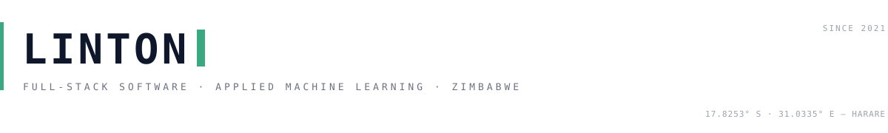

<picture>
  <source media="(prefers-color-scheme: dark)" srcset="./assets/hero-dark.svg" />
  
</picture>

I build production software and the models behind it — from Harare, Zimbabwe. Product work ships as TypeScript. Research work ships as Python. Both are documented enough to reproduce.

<table>
<tr>
<td width="63%" valign="top">

**Product engineering**

TypeScript, React, Next.js, PostgreSQL, Prisma. <samp>40+</samp> applications designed, built, and shipped — education platforms, commerce, logistics, workshop operations — many live in production for clients across Zimbabwe.

**Applied machine learning**

Python, scikit-learn, PyTorch, Jupyter. Screening and forecasting models with documented evaluation protocols: dementia risk, crop yield, queue wait times, fraud detection.

</td>
<td width="37%" valign="top">

**Elsewhere**

<a href="https://chimaliro.com">chimaliro.com</a> · portfolio 
<a href="https://tracker.chimaliro.com">tracker.chimaliro.com</a> · live product 
<a href="https://linkedin.com/in/tinolinton">LinkedIn</a> · network 
<a href="mailto:dev@chimaliro.com">dev@chimaliro.com</a> · direct

&nbsp;

On GitHub: <samp>88</samp> repositories · <samp>41</samp> TypeScript · <samp>13</samp> notebooks

</td>
</tr>
</table>

## Selected work

Public projects with open code and a documented process. Newest research first.

| | | |
|:-:|:-|:-:|
| <samp>01</samp> | **[Dementia risk prediction](https://github.com/tinolinton/ml_dementia)** — DNN-primary, LSTM-secondary screening models, trained and internally validated on the Gweru 2020–2025 cohort, with deployment-ready checkpoints exported. | `Python` `PyTorch` |
| <samp>02</samp> | **[Tracker](https://github.com/tinolinton/tracker)** — AI resume workspace: benchmarks a CV against a target role, rebuilds the PDF, drafts the tailored application email. Public demo at [tracker.chimaliro.com](https://tracker.chimaliro.com). | `React` `TypeScript` |
| <samp>03</samp> | **[ZimProvisional](https://github.com/tinolinton/zdc)** — practice platform for the Zimbabwean provisional driving test: question bank, progress tracking, admin tooling. | `Next.js` `PostgreSQL` |
| <samp>04</samp> | **[Queue wait forecasting](https://github.com/tinolinton/GB-Queue)** — gradient-boosted wait-time estimates with arrival and service features, chronological validation, residual analysis. | `Python` `scikit-learn` |
| <samp>05</samp> | **[Crop yield modelling](https://github.com/tinolinton/Yield-Predictive-Model)** — machine-learning comparison for maize and soyabean yields in Mashonaland West. | `Python` `Jupyter` |

Browse the rest at [tinolinton?tab=repositories](https://github.com/tinolinton?tab=repositories).

## Stack

 

## Signal

<table>
<tr>
<td width="50%"></td>
<td width="50%"></td>
</tr>
</table>

## Activity

<picture>
  <source media="(prefers-color-scheme: dark)" srcset="https://raw.githubusercontent.com/tinolinton/tinolinton/output/snake-dark.svg" />
  
</picture>

---

**Open to collaboration** — data problems, product builds, research partnerships. Write to **[dev@chimaliro.com](mailto:dev@chimaliro.com)**.

<samp>plain markdown · zero trackers · light and dark native · refreshed 2026-09-30</samp>
