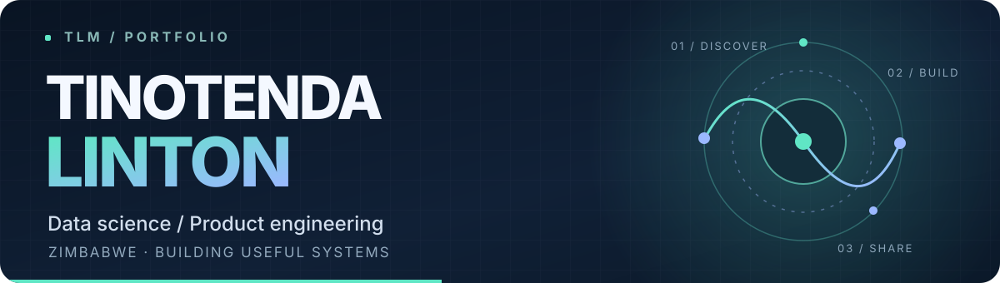

  

  I turn complex questions into useful models and software. 
  From agricultural forecasting and health research to tools people use every day.

  <a href="#selected-work">Selected work</a> &nbsp;·&nbsp;
  <a href="#behind-the-build">Behind the build</a> &nbsp;·&nbsp;
  <a href="https://chimaliro.com">Portfolio ↗</a> &nbsp;·&nbsp;
  <a href="mailto:dev@chimaliro.com">Get in touch ↗</a>

---

## Selected work

Five public projects that show how I approach research, modelling, and product development. Select a panel to open its repository.

<a href="https://github.com/tinolinton?tab=repositories">Browse all public repositories ↗</a>

## Behind the build

<strong>01 / Applied data and machine learning</strong> — open project notes

 

- **[Dementia risk research](https://github.com/tinolinton/ml_dementia)** — compares DNN and LSTM approaches under one documented evaluation protocol. The repository includes data preparation, model design, and limitations. Python · PyTorch · research
- **[Queue wait forecasting](https://github.com/tinolinton/GB-Queue)** — engineers arrival, service, and time features for a gradient boosting model, with chronological validation and residual analysis. Python · scikit-learn · forecasting
- **[Crop yield modelling](https://github.com/tinolinton/Yield-Predictive-Model)** — compares machine learning approaches for maize and soyabean yields in Mashonaland West. Python · notebooks · agriculture

<strong>02 / Software people can use</strong> — open project notes

 

- **[ZimProvisional](https://github.com/tinolinton/zdc)** — a driving-test preparation app with practice sessions, feedback, progress tracking, and administration. TypeScript · Next.js · PostgreSQL
- **[Tracker](https://github.com/tinolinton/tracker)** — a resume and application workspace that reviews job fit, prepares a revised PDF, and drafts outreach. React · TypeScript · AI

## What I work with

| Data and research | Product engineering |
| :--- | :--- |
| Python · pandas · scikit-learn · PyTorch · Jupyter | TypeScript · React · Next.js · PostgreSQL · Prisma |

## Connect

Based in Zimbabwe. Find more of my work at **[chimaliro.com](https://chimaliro.com)**, connect on **[LinkedIn](https://linkedin.com/in/tinolinton)**, or email **[dev@chimaliro.com](mailto:dev@chimaliro.com)**.

Built to be readable, quick to load, and useful in light or dark mode.

